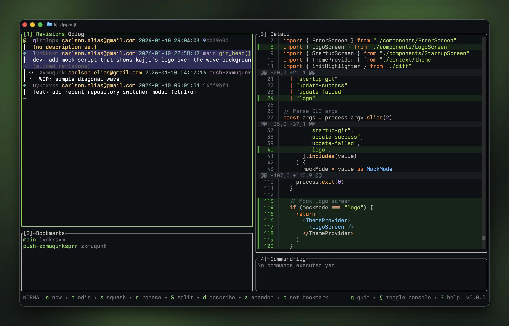

<p align="center">
  
</p>

# kajji

A terminal UI for [jj / Jujutsu](https://github.com/martinvonz/jj): navigate changes, inspect polished diffs, and run common jj workflows with ease and speed.

Kajji gives jj a fast, keyboard-first interface with a commit graph, file tree, operation log, bookmark management, GitHub helpers, revset filtering, and custom diff rendering with syntax highlighting, word-level emphasis, split/unified layouts, wrapping, and binary-file handling.



## Installation

```bash
# recommended if you use Homebrew
brew install eliaskc/tap/kajji

# standalone binary installer, no package manager required
curl -fsSL https://kajji.sh/install.sh | bash

# or via JavaScript package manager
npm install -g kajji
bun install -g kajji
pnpm add -g kajji
yarn global add kajji

# or run directly without installing
npx kajji
bunx kajji
```

To remove kajji and its config/data:

```bash
kajji uninstall                       # interactive: removes config, data, and the binary
kajji uninstall --dry-run             # show what would be removed
kajji uninstall --keep-config --keep-data
kajji uninstall --force               # skip the confirmation prompt
```

### From source

Requirements: [Bun](https://bun.sh)

```bash
git clone https://github.com/eliaskc/kajji.git
cd kajji
bun install
bun dev
```

## Usage

Run `kajji` in any jj repository:

```bash
kajji                    # current directory
kajji /path/to/repo      # specific directory
```

Kajji has two main viewing modes:

- **Normal mode** keeps the log, bookmarks, detail, and command log visible.
- **Diff focus mode** gives the detail pane more space for side-by-side diffs.

Toggle between them with `ctrl+x`.

## Features

**jj workflows**

- Commit log with graph and revset filtering
- File view with tree/list toggle, editor launching, and discard for working-copy files
- New, edit, describe, squash, abandon, duplicate, rebase, split, resolve
- Undo, redo, operation log, and restore
- Bookmark create/delete/rename/forget/set/move plus remote-only filtering
- Git fetch/push menus
- Open commits and PRs on GitHub
- Recent repository switcher

**Diff viewing**

- Custom unified and split diff renderers
- Syntax highlighting and word-level change emphasis
- Line wrapping and horizontal scrolling
- Hunk and file navigation
- Optional jj formatter output
- Binary file detection

**TUI polish**

- Vim-style navigation plus mouse support
- Focusable panels and tabs
- Command palette with fuzzy search (`?` / `ctrl+p`)
- Context-aware status hints
- JSONC config with schema autocomplete
- Automatic update notifications

## CLI

Kajji includes a small CLI for scripting and agent workflows:

```bash
# List changes with addressable hunk IDs
kajji changes -r @

# Comments
kajji comment list -r @
kajji comment set -r @ --hunk h1 -m "note"
kajji comment set -r @ --file src/App.tsx --line 12 -m "note"
kajji comment delete -r @ --hunk h1
kajji comment delete -r @ --file src/App.tsx --line 12
kajji comment delete -r @ --file src/App.tsx
kajji comment delete -r @ --all -y
```

## Configuration

Kajji reads JSONC config from `~/.config/kajji/config.json` (comments and trailing commas are supported).

- Open it from the command palette (`?`) with `open config`
- Changes made through `open config` are reloaded when you return to kajji
- The default config includes `$schema: "https://kajji.sh/schema.json"` for editor autocomplete

Common settings include:

- `ui.themeMode`: `system`, `dark`, or `light`
- `ui.syntaxTheme.dark` / `ui.syntaxTheme.light`: syntax highlighting theme names
- `ui.showFileTree`: show files as a tree or flat list
- `diff.layout`: `auto`, `unified`, or `split`
- `diff.autoSwitchWidth`: terminal width where `auto` switches to split view
- `diff.wrap`: wrap long diff lines
- `diff.useJjFormatter`: use jj's configured diff formatter in the detail pane
- `gitHooksPath`: default Git-compatible hooks directory to check for `pre-commit` before `jj.new` (`.git/hooks` enables standard per-repo Git hooks in every repo)
- `repos`: repo-specific `gitHooksPath` and operation hooks keyed by repository path
- `whatsNewDisabled` / `autoUpdatesDisabled`: update notification controls

## Keybindings

Default keybindings are contextual. Press `?` or `ctrl+p` in kajji for the full command list available in the current panel.

### Global and navigation

| Key                    | Action                                  |
| ---------------------- | --------------------------------------- |
| `q`                    | Quit                                    |
| `?` / `ctrl+p`         | Command palette                         |
| `Tab` / `shift+Tab`    | Next / previous panel                   |
| `1` / `2` / `3` / `4`  | Focus log / refs / detail / command log |
| `j` / `k` or `↓` / `↑` | Move down / up                          |
| `ctrl+d` / `ctrl+u`    | Page down / up                          |
| `Enter`                | Open/drill into the selected item       |
| `Escape`               | Back, close, or clear filter            |
| `[` / `]` or `h` / `l` | Previous / next tab                     |
| `/`                    | Filter revisions or bookmarks           |
| `ctrl+r`               | Refresh                                 |
| `ctrl+x`               | Toggle normal/diff focus mode           |
| `ctrl+o`               | Open recent repository                  |

### jj operations

| Key       | Action                                                                                     |
| --------- | ------------------------------------------------------------------------------------------ |
| `n` / `N` | New change / new menu                                                                      |
| `e`       | Edit change, or open selected file in editor from file view                                |
| `E`       | Open all files in editor from file view                                                    |
| `d`       | Describe, delete bookmark, restore operation, or discard file changes depending on context |
| `s`       | Squash                                                                                     |
| `a`       | Abandon                                                                                    |
| `r`       | Rebase, or rename bookmark in refs                                                         |
| `S`       | Split                                                                                      |
| `D`       | Duplicate                                                                                  |
| `R`       | Resolve conflicts, or toggle remote-only bookmarks in refs                                 |
| `u` / `U` | Undo / redo                                                                                |
| `f` / `F` | Git fetch / fetch menu                                                                     |
| `p` / `P` | Git push / push menu                                                                       |

### Diff and files

| Key                    | Action                                                        |
| ---------------------- | ------------------------------------------------------------- |
| `-`                    | Toggle file tree/list in file view, or jj formatter in detail |
| `v`                    | Toggle split/unified diff                                     |
| `w`                    | Toggle diff line wrapping                                     |
| `h` / `l` or `←` / `→` | Horizontal scroll when wrapping is off                        |
| `[` / `]`              | Previous / next hunk in custom diff view                      |
| `{` / `}`              | Previous / next file in custom diff view                      |

### Bookmarks and GitHub

| Key       | Action                                             |
| --------- | -------------------------------------------------- |
| `c`       | Create bookmark                                    |
| `d`       | Delete bookmark                                    |
| `r`       | Rename bookmark                                    |
| `x`       | Forget bookmark locally                            |
| `b`       | Set bookmark on selected revision                  |
| `m`       | Move bookmark                                      |
| `o` / `O` | Open selected revision on GitHub (prompt / direct) |
| `o`       | Open selected bookmark's commit or PR on GitHub    |

## Built With

- [OpenTUI](https://github.com/sst/opentui) + [SolidJS](https://www.solidjs.com/) - TypeScript TUI framework
- [Bun](https://bun.sh) - JavaScript runtime and build tooling
- [jj (Jujutsu)](https://github.com/martinvonz/jj) - Git-compatible VCS

## Related Projects

- [lazygit](https://github.com/jesseduffield/lazygit) - Git TUI
- [jjui](https://github.com/idursun/jjui) - Go-based jj TUI
- [lazyjj](https://github.com/Cretezy/lazyjj) - Rust-based jj TUI

## License

MIT
